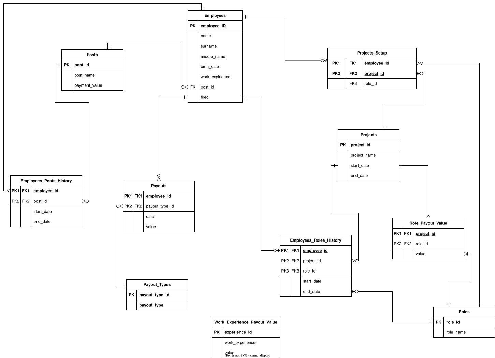

# SalaryStatement_JAVA_WEB
Web application for accounting, redacting salary and project information of employee.

In file "SalarySatementDBScheme.drawio" you can see ER-diagram of database.

In file "SalarySatementWeb.drawio" you can see models of web-pages with main buttons, text fields e.t.c. Look into file "PagesDescription"  to understand signs' specification and written organisation of pages and navigation.

To open these files use drawio application.

In file "UseCases" you can see usecases of web-application.

File "SalaryDB.sql" contains sql-script for creating database. 

You can find JAVA classes for database tables in /salary-statement/src/main/java/salary_statement_models

salary-statement/src/main/resources/META-INF/orm.xml - mapping java classes to database tables file

